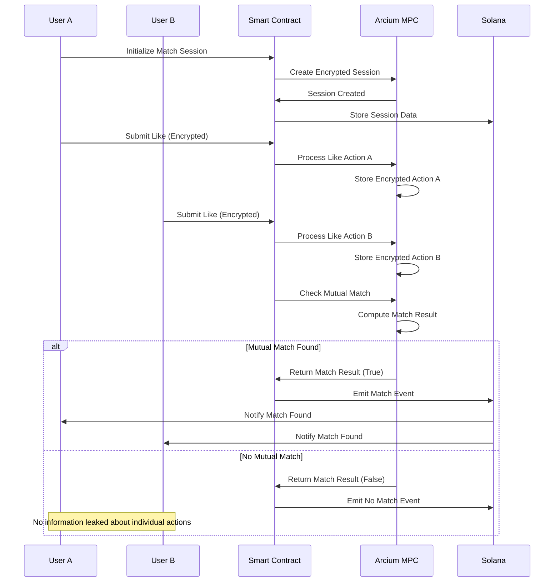

# Encrypted Dating App

## Introduction

### What is Encrypted Dating App?

This is a privacy-first dating application built on Solana blockchain using Multi-Party Computation (MPC) technology through the Arcium network. The app ensures complete privacy of sensitive user data while enabling secure matching between users without revealing personal information unless a mutual match occurs.

### Key Features

- **Zero-Knowledge Matching**: Users can express interest in each other without revealing their actions unless both parties like each other
- **Encrypted Sensitive Data**: Income, detailed preferences, and personal information are encrypted and never exposed publicly
- **Blockchain Security**: All interactions are recorded on Solana blockchain with cryptographic proofs
- **MPC Privacy**: Multi-Party Computation ensures sensitive operations happen without data exposure
- **Decentralized**: No central authority can access user's private information

### Why Use Encrypted Dating?

Traditional dating apps expose user data to companies, store sensitive information in centralized databases, and can reveal user preferences and actions. Our solution:

- **Privacy by Design**: Sensitive data encrypted client-side before blockchain storage
- **No Data Mining**: Platform cannot access or sell user data
- **Secure Matching**: MPC reveals match results without exposing individual preferences
- **Transparent Operations**: All matching logic runs on verifiable smart contracts
- **User Control**: Users own their data and encryption keys

## How It Works

### Overview Flow

```
1. User Creates Profile
   ├── Public Data (username, age, location) → Stored plaintext on blockchain
   └── Sensitive Data (income, detailed preferences) → Encrypted client-side → Stored encrypted

2. User Discovers Other Profiles
   ├── View public profile information only
   └── Cannot see others' sensitive data or past actions

3. User Initiates Match
   ├── Creates encrypted match session between two users
   └── Initializes MPC computation environment

4. Users Express Interest
   ├── Like/Pass actions encrypted and submitted to MPC
   └── Individual actions remain hidden from other party

5. Match Resolution
   ├── MPC computation determines if mutual interest exists
   ├── Result revealed only if both users liked each other
   └── No match = no information leaked about individual actions
```

### Privacy Guarantees

1. **Individual Actions Hidden**: If only one person likes, the other never knows
2. **Sensitive Data Protected**: Income, detailed preferences never exposed
3. **Match History Private**: Past interactions encrypted and user-controlled
4. **No Metadata Leaks**: MPC prevents inference attacks on user behavior
5. **Forward Secrecy**: Past matches remain private even if keys compromised

## System Architecture

### Component Architecture

#### 1. Frontend Layer
```
├── src/
    ├── components/
    │   ├── ProfileCreation.tsx     # User profile setup
    │   ├── ProfileDiscovery.tsx    # Browse other users
    │   ├── MatchingInterface.tsx   # Like/Pass actions
    │   ├── MatchResults.tsx        # Display results
    │   └── ChatInterface.tsx       # Post-match communication
    ├── services/
    │   ├── EncryptionService.ts    # Client-side encryption
    │   ├── MatchingService.ts      # MPC interaction
    │   ├── BlockchainService.ts    # Solana operations
    │   └── StorageService.ts       # Secure key management
    ├── store/
    │   ├── userStore.ts           # User state management
    │   ├── matchStore.ts          # Match state tracking
    │   └── appStore.ts            # Application state
    └── utils/
        ├── encryption.ts          # Crypto utilities
        ├── validation.ts          # Input validation
        └── constants.ts           # App constants
```

#### 2. Smart Contract Layer
```
programs/contract/src/
├── lib.rs                     # Main program module
├── instructions/
│   ├── create_profile.rs      # Profile creation logic
│   ├── init_match_session.rs  # Session initialization
│   ├── submit_like.rs         # Like submission
│   └── check_match.rs         # Match verification
├── state/
│   ├── user_profile.rs        # User account structure
│   ├── match_session.rs       # Session account structure
│   └── events.rs              # Event definitions
└── errors.rs                  # Error handling
```

#### 3. MPC Circuit Layer
```
encrypted-ixs/src/
├── lib.rs                     # Circuit definitions
├── circuits/
│   ├── init_session.rs        # Session initialization circuit
│   ├── submit_like.rs         # Like submission circuit
│   ├── check_match.rs         # Match checking circuit
│   └── compatibility.rs       # Compatibility scoring
└── types/
    ├── session_data.rs        # Session data structures
    ├── user_action.rs         # User action types
    └── match_result.rs        # Result types
```

### Data Flow Architecture

#### 1. Profile Creation Flow
```
User Input → Client Validation → Key Generation → Data Encryption → 
Blockchain Transaction → Account Creation → Event Emission → UI Update
```

#### 2. Matching Flow
```
User Discovery → Target Selection → Session Creation → MPC Initialization →
Like Encryption → MPC Submission → Computation Execution → Result Callback →
UI Notification → Match Resolution
```

#### 3. Privacy Flow
```
Sensitive Data → Client Encryption → Blockchain Storage (Encrypted) →
MPC Access (Encrypted) → Computation (Zero-Knowledge) → Result (If Match) →
No Information Leak (If No Match)
```

### Security Architecture

#### Encryption Layers
1. **Client-Side Encryption**: XOR with user private key for profile data
2. **MPC Encryption**: RescueCipher with shared secrets for computations
3. **Transport Security**: HTTPS for all API communications
4. **Storage Security**: Encrypted local storage for sensitive keys

#### Access Control
1. **Profile Access**: Only profile owner can modify
2. **Session Access**: Only participating users can interact
3. **MPC Access**: Only authorized computations can access encrypted data
4. **Key Management**: Client-side key generation and storage

#### Privacy Preservation
1. **Zero-Knowledge Proofs**: MPC reveals only match results
2. **Encrypted State**: All sensitive operations use encrypted inputs
3. **No Metadata Leaks**: Timing and frequency analysis protected
4. **Forward Secrecy**: Past interactions remain secure

### Scalability Architecture

#### Horizontal Scaling
- **Multiple Sessions**: Parallel matching sessions supported
- **User Sharding**: Profile data distributed across multiple accounts
- **Computation Batching**: Multiple MPC operations can run concurrently
- **Event Processing**: Asynchronous event handling for UI updates

#### Performance Optimization
- **State Compression**: Efficient data structures for blockchain storage
- **Caching Layer**: Client-side caching for frequently accessed data
- **Lazy Loading**: Profile data loaded on demand
- **Background Processing**: MPC computations run in background

#### Cost Optimization
- **Transaction Batching**: Multiple operations in single transaction
- **Compute Limits**: Size restrictions prevent excessive gas usage
- **Efficient Encoding**: Minimal data structures for cost reduction
- **Fee Estimation**: Dynamic fee calculation for optimal costs

## Core Data Structures

### User Profile Data
```rust
// Profile creation input (client-side)
pub struct CreateProfileInput {
    pub username: String,
    pub avatar_url: String,
    pub age: u8,
    pub location_city: String,
    pub private_data: PrivateProfileData,
    pub preferences: MatchingPreferences,
}

// Encrypted blockchain data
pub struct CreateProfileData {
    pub username: String,
    pub avatar_url: String,
    pub age: u8,
    pub location_city: String,
    pub encrypted_private_data: Vec<u8>,    // Encrypted income data
    pub encrypted_preferences: Vec<u8>,     // Encrypted matching criteria
    pub encryption_pubkey: [u8; 32],        // User's public key
    pub profile_version: u8,
}

// Sensitive data (gets encrypted)
pub struct PrivateProfileData {
    pub income: String,
}

// Matching preferences (gets encrypted)
pub struct MatchingPreferences {
    pub preferred_age_min: u8,
    pub preferred_age_max: u8,
    pub preferred_distance_km: u16,
    pub interests: Vec<String>,
    pub relationship_type: String,
}
```

### Blockchain Accounts
```rust
// User profile stored on-chain (3K+ bytes)
pub struct UserProfile {
    // Account metadata
    pub owner: Pubkey,
    pub bump: u8,
    pub created_at: i64,
    pub last_updated: i64,
    pub profile_version: u8,
    
    // Public profile info
    pub username: String,
    pub avatar_url: String,
    pub age: u8,
    pub location_city: String,
    pub is_active: bool,
    
    // Encrypted data
    pub encryption_pubkey: [u8; 32],
    pub encrypted_private_data: Vec<u8>,     // Max 1000 bytes
    pub encrypted_preferences: Vec<u8>,      // Max 500 bytes
    
    // Encrypted interaction history
    pub encrypted_likes_given: Vec<u8>,
    pub encrypted_likes_received: Vec<u8>,
    pub encrypted_matches: Vec<u8>,
    
    // Public statistics
    pub total_likes_given: u32,
    pub total_likes_received: u32,
    pub total_matches: u32,
}

// Match session for two users
pub struct MatchPairSession {
    pub session_id: u64,
    pub user_a: Pubkey,
    pub user_b: Pubkey,
    pub encrypted_match_data: [[u8; 32]; 6], // MPC session data
    pub nonce: u128,
    pub created_at: i64,
    pub last_updated: i64,
    pub is_finalized: bool,
    pub match_found: bool,
    pub bump: u8,
}
```

### MPC Circuit Data
```rust
// Match session state (MPC)
pub struct MatchSession {
    user_a_id: u64,
    user_b_id: u64,
    user_a_liked: bool,
    user_b_liked: bool,
    session_created_at: u64,
    last_updated: u64,
}

// Like action input (MPC)
pub struct UserLikeAction {
    user_id: u64,
    target_id: u64,
    like_action: bool,
    timestamp: u64,
}

// Match result output
pub struct MatchResult {
    is_mutual_match: bool,
    session_status: u8,  // 0=pending, 1=match, 2=no_match
    match_timestamp: u64,
}
```

## System Architecture


### Data Flow
1. **Profile Creation**: Client encrypts sensitive data → Store on blockchain
2. **Match Initiation**: Create session → Initialize MPC computation
3. **Like Submission**: Encrypt like action → Submit to MPC
4. **Match Detection**: Both users liked → MPC reveals match result
5. **Result Delivery**: Callback updates blockchain state → Emit events

### MPC Operations Flow

#### Detailed MPC Flow Diagram



## Frontend Integration Guide

### 1. Install Dependencies
```bash
npm install @coral-xyz/anchor @solana/web3.js @arcium-hq/client
npm install @noble/curves
```

### 2. Core Client Setup
```typescript
import * as anchor from "@coral-xyz/anchor";
import { PublicKey, Connection } from "@solana/web3.js";
import { x25519 } from "@noble/curves/ed25519";
import { RescueCipher, getMXEPublicKey } from "@arcium-hq/client";

const connection = new Connection("https://api.devnet.solana.com");
const wallet = /* your wallet adapter */;
const provider = new anchor.AnchorProvider(connection, wallet, {});
const program = new anchor.Program(IDL, PROGRAM_ID, provider);
```

### 3. Create User Profile
```typescript
async function createProfile(profileInput: CreateProfileInput) {
    // Generate encryption keypair
    const userPrivateKey = x25519.utils.randomSecretKey();
    const userPublicKey = x25519.getPublicKey(userPrivateKey);
    
    // Encrypt sensitive data
    const encryptedPrivateData = encryptData(
        profileInput.private_data, 
        userPrivateKey,
        1000  // max size
    );
    const encryptedPreferences = encryptData(
        profileInput.preferences, 
        userPrivateKey,
        500   // max size
    );
    
    // Create profile on blockchain
    const profileData = {
        username: profileInput.username,
        avatarUrl: profileInput.avatar_url,
        age: profileInput.age,
        locationCity: profileInput.location_city,
        encryptedPrivateData: Buffer.from(encryptedPrivateData),
        encryptedPreferences: Buffer.from(encryptedPreferences),
        encryptionPubkey: Array.from(userPublicKey),
        profileVersion: 1,
    };
    
    const [userProfilePDA] = PublicKey.findProgramAddressSync(
        [Buffer.from("user_profile"), wallet.publicKey.toBuffer()],
        PROGRAM_ID
    );
    
    await program.methods
        .createProfile(profileData)
        .accounts({
            userProfile: userProfilePDA,
            user: wallet.publicKey,
            systemProgram: anchor.web3.SystemProgram.programId,
        })
        .rpc();
    
    return { userProfilePDA, userPrivateKey };
}
```

### 4. Initialize Match Session
```typescript
async function initializeMatchSession(userA: PublicKey, userB: PublicKey) {
    const sessionId = Date.now();
    const nonce = Date.now();
    
    const [matchSessionPDA] = PublicKey.findProgramAddressSync(
        [
            Buffer.from("match_session"),
            Buffer.from(new anchor.BN(sessionId).toArray("le", 8))
        ],
        PROGRAM_ID
    );
    
    const computationOffset = new anchor.BN(randomBytes(8), "hex");
    
    await program.methods
        .initMatchSession(
            computationOffset,
            new anchor.BN(sessionId),
            userA,
            userB,
            new anchor.BN(nonce)
        )
        .accounts({
            matchPairSession: matchSessionPDA,
            payer: wallet.publicKey,
            // ... other required accounts
        })
        .rpc();
    
    // Wait for MPC computation to complete
    await awaitComputationFinalization(
        provider,
        computationOffset,
        PROGRAM_ID
    );
    
    return { sessionId, matchSessionPDA };
}
```

### 5. Submit Like Action
```typescript
async function submitLike(
    sessionPDA: PublicKey, 
    targetUserId: PublicKey, 
    likeAction: boolean
) {
    // Get MXE public key for encryption
    const mxePublicKey = await getMXEPublicKey(provider, PROGRAM_ID);
    
    // Generate MPC encryption keys
    const mpcPrivateKey = x25519.utils.randomSecretKey();
    const mpcPublicKey = x25519.getPublicKey(mpcPrivateKey);
    const sharedSecret = x25519.getSharedSecret(mpcPrivateKey, mxePublicKey);
    const cipher = new RescueCipher(sharedSecret);
    
    // Prepare like action data
    const userId = new anchor.BN(wallet.publicKey.toBuffer().slice(0, 8), "le");
    const targetId = new anchor.BN(targetUserId.toBuffer().slice(0, 8), "le");
    const timestamp = Math.floor(Date.now() / 1000);
    
    // Encrypt action data
    const nonce = randomBytes(16);
    const ciphertext = cipher.encrypt(
        [
            BigInt(userId.toString()),
            BigInt(targetId.toString()),
            likeAction ? BigInt(1) : BigInt(0),
            BigInt(timestamp)
        ],
        nonce
    );
    
    const computationOffset = new anchor.BN(randomBytes(8), "hex");
    
    await program.methods
        .submitLike(
            computationOffset,
            Array.from(ciphertext[0]), // encrypted_user_id
            Array.from(ciphertext[1]), // encrypted_target_id
            Array.from(ciphertext[2]), // encrypted_like_action
            Array.from(ciphertext[3]), // encrypted_timestamp
            Array.from(mpcPublicKey),
            new anchor.BN(deserializeLE(nonce).toString())
        )
        .accounts({
            matchPairSession: sessionPDA,
            user: wallet.publicKey,
            // ... other required accounts
        })
        .rpc();
    
    // Wait for MPC computation
    await awaitComputationFinalization(
        provider,
        computationOffset,
        PROGRAM_ID
    );
}
```

### 6. Check Match Result
```typescript
async function checkMutualMatch(sessionPDA: PublicKey) {
    const computationOffset = new anchor.BN(randomBytes(8), "hex");
    
    await program.methods
        .checkMutualMatch(computationOffset)
        .accounts({
            matchPairSession: sessionPDA,
            payer: wallet.publicKey,
            // ... other required accounts
        })
        .rpc();
    
    // Wait for result
    await awaitComputationFinalization(
        provider,
        computationOffset,
        PROGRAM_ID
    );
    
    // Get final session state
    const session = await program.account.matchPairSession.fetch(sessionPDA);
    
    return {
        isFinalized: session.isFinalized,
        matchFound: session.matchFound,
        sessionId: session.sessionId.toString()
    };
}
```

### 7. Event Listening
```typescript
// Listen for profile creation
program.addEventListener("profileCreatedEvent", (event) => {
    console.log("Profile created:", event.username);
});

// Listen for match results
program.addEventListener("mutualMatchFoundEvent", (event) => {
    console.log("Match found!", event.userA, event.userB);
});

program.addEventListener("noMutualMatchEvent", (event) => {
    console.log("No match:", event.sessionId);
});
```

### 8. Utility Functions
```typescript
function encryptData(data: any, privateKey: Uint8Array, maxSize: number): Uint8Array {
    const jsonData = JSON.stringify(data);
    const dataBytes = Buffer.from(jsonData, 'utf8');
    const finalSize = Math.min(dataBytes.length, maxSize);
    const encrypted = new Uint8Array(finalSize);
    
    for (let i = 0; i < finalSize; i++) {
        encrypted[i] = dataBytes[i] ^ privateKey[i % privateKey.length];
    }
    
    return encrypted;
}

function randomBytes(size: number): Uint8Array {
    return crypto.getRandomValues(new Uint8Array(size));
}
```

## Key Technical Points

### Encryption Strategy
- **Profile Data**: XOR encryption with user private key
- **MPC Data**: RescueCipher with shared secret (x25519 + MXE public key)
- **Data Limits**: Private data ≤1000 bytes, Preferences ≤500 bytes

### MPC Computation Flow
1. **Sequential Operations**: Init → Like A → Like B → Check Match
2. **Async Callbacks**: Each MPC operation has init + callback pattern
3. **State Management**: Encrypted state preserved between operations

### Account Management
- **Profile PDA**: `["user_profile", user_pubkey]`
- **Session PDA**: `["match_session", session_id_bytes]`
- **Space Requirements**: Profile ~3KB, Session ~300 bytes

### Performance Considerations
- **MPC Timeouts**: 15-20 seconds per operation
- **Gas Costs**: Higher due to MPC operations
- **Parallel Sessions**: Multiple matches can run concurrently

## Advanced Implementation Details

### 1. Complete React Component Example

```typescript
import React, { useState, useEffect } from 'react';
import { useWallet } from '@solana/wallet-adapter-react';
import * as anchor from "@coral-xyz/anchor";
import { PublicKey } from "@solana/web3.js";

interface Profile {
    username: string;
    age: number;
    location: string;
    avatarUrl: string;
}

interface MatchingState {
    isMatching: boolean;
    currentSession?: string;
    matchResult?: boolean;
}

const DatingApp: React.FC = () => {
    const { publicKey, connected } = useWallet();
    const [profile, setProfile] = useState<Profile | null>(null);
    const [matchingState, setMatchingState] = useState<MatchingState>({
        isMatching: false
    });
    const [nearbyUsers, setNearbyUsers] = useState<Profile[]>([]);
    
    // Initialize program connection
    const [program, setProgram] = useState<anchor.Program | null>(null);
    
    useEffect(() => {
        if (connected && publicKey) {
            initializeProgram();
            loadUserProfile();
            loadNearbyUsers();
        }
    }, [connected, publicKey]);
    
    const initializeProgram = async () => {
        const connection = new anchor.web3.Connection(
            process.env.REACT_APP_RPC_ENDPOINT || "https://api.devnet.solana.com"
        );
        const wallet = /* your wallet adapter */;
        const provider = new anchor.AnchorProvider(connection, wallet, {
            commitment: 'confirmed'
        });
        const programInstance = new anchor.Program(IDL, PROGRAM_ID, provider);
        setProgram(programInstance);
    };
    
    const createProfile = async (profileData: any) => {
        if (!program || !publicKey) return;
        
        try {
            // Generate encryption keys
            const userPrivateKey = x25519.utils.randomSecretKey();
            const userPublicKey = x25519.getPublicKey(userPrivateKey);
            
            // Prepare sensitive data
            const privateData = {
                income: profileData.income,
                personalDetails: profileData.personalDetails
            };
            
            const preferences = {
                preferredAgeMin: profileData.ageRange[0],
                preferredAgeMax: profileData.ageRange[1],
                preferredDistanceKm: profileData.maxDistance,
                interests: profileData.interests,
                relationshipType: profileData.relationshipType
            };
            
            // Encrypt sensitive data
            const encryptedPrivateData = encryptData(privateData, userPrivateKey, 1000);
            const encryptedPreferences = encryptData(preferences, userPrivateKey, 500);
            
            // Create blockchain profile
            const createProfileData = {
                username: profileData.username,
                avatarUrl: profileData.avatarUrl,
                age: profileData.age,
                locationCity: profileData.location,
                encryptedPrivateData: Buffer.from(encryptedPrivateData),
                encryptedPreferences: Buffer.from(encryptedPreferences),
                encryptionPubkey: Array.from(userPublicKey),
                profileVersion: 1,
            };
            
            const [userProfilePDA] = PublicKey.findProgramAddressSync(
                [Buffer.from("user_profile"), publicKey.toBuffer()],
                PROGRAM_ID
            );
            
            const tx = await program.methods
                .createProfile(createProfileData)
                .accounts({
                    userProfile: userProfilePDA,
                    user: publicKey,
                    systemProgram: anchor.web3.SystemProgram.programId,
                })
                .rpc();
            
            console.log("Profile created:", tx);
            
            // Store encryption key securely (localStorage for demo)
            localStorage.setItem('userEncryptionKey', 
                Buffer.from(userPrivateKey).toString('base64')
            );
            
            setProfile({
                username: profileData.username,
                age: profileData.age,
                location: profileData.location,
                avatarUrl: profileData.avatarUrl
            });
            
        } catch (error) {
            console.error("Failed to create profile:", error);
            throw error;
        }
    };
    
    const initiateMatch = async (targetUserPubkey: string) => {
        if (!program || !publicKey) return;
        
        setMatchingState({ isMatching: true });
        
        try {
            const targetPubkey = new PublicKey(targetUserPubkey);
            
            // Step 1: Initialize match session
            const { sessionId, matchSessionPDA } = await initializeMatchSession(
                publicKey, 
                targetPubkey
            );
            
            setMatchingState(prev => ({ 
                ...prev, 
                currentSession: sessionId.toString() 
            }));
            
            // Step 2: Submit like action
            await submitLike(matchSessionPDA, targetPubkey, true);
            
            // Step 3: Wait for target user's response (in real app, this would be handled by events)
            // For demo, we'll simulate the target user's response
            setTimeout(async () => {
                // Simulate target user liking back
                await simulateTargetUserLike(matchSessionPDA, publicKey);
                
                // Step 4: Check mutual match
                const result = await checkMutualMatch(matchSessionPDA);
                
                setMatchingState({
                    isMatching: false,
                    currentSession: sessionId.toString(),
                    matchResult: result.matchFound
                });
                
            }, 5000);
            
        } catch (error) {
            console.error("Match initiation failed:", error);
            setMatchingState({ isMatching: false });
        }
    };
    
    const loadUserProfile = async () => {
        if (!program || !publicKey) return;
        
        try {
            const [userProfilePDA] = PublicKey.findProgramAddressSync(
                [Buffer.from("user_profile"), publicKey.toBuffer()],
                PROGRAM_ID
            );
            
            const profileAccount = await program.account.userProfile.fetch(userProfilePDA);
            
            setProfile({
                username: profileAccount.username,
                age: profileAccount.age,
                location: profileAccount.locationCity,
                avatarUrl: profileAccount.avatarUrl
            });
            
        } catch (error) {
            console.log("No profile found, user needs to create one");
        }
    };
    
    const loadNearbyUsers = async () => {
        if (!program) return;
        
        try {
            // Fetch all user profiles (in production, this would be filtered by location)
            const profiles = await program.account.userProfile.all();
            
            const users = profiles
                .filter(p => !p.account.owner.equals(publicKey!))
                .map(p => ({
                    username: p.account.username,
                    age: p.account.age,
                    location: p.account.locationCity,
                    avatarUrl: p.account.avatarUrl,
                    pubkey: p.account.owner.toString()
                }));
            
            setNearbyUsers(users);
            
        } catch (error) {
            console.error("Failed to load nearby users:", error);
        }
    };
    
    if (!connected) {
        return (
            <div className="connect-wallet">
                <h2>Connect Your Wallet</h2>
                <p>Please connect your Solana wallet to use the dating app</p>
            </div>
        );
    }
    
    if (!profile) {
        return (
            <div className="create-profile">
                <h2>Create Your Profile</h2>
                <ProfileCreationForm onSubmit={createProfile} />
            </div>
        );
    }
    
    return (
        <div className="dating-app">
            <header>
                <h1>Encrypted Dating</h1>
                <div className="profile-summary">
                    
                    <span>{profile.username}, {profile.age}</span>
                </div>
            </header>
            
            <main>
                {matchingState.isMatching ? (
                    <div className="matching-state">
                        <h2>Processing Match...</h2>
                        <div className="loading-spinner" />
                        <p>Session: {matchingState.currentSession}</p>
                    </div>
                ) : matchingState.matchResult !== undefined ? (
                    <div className="match-result">
                        {matchingState.matchResult ? (
                            <div className="match-success">
                                <h2>🎉 It's a Match!</h2>
                                <p>You can start chatting now</p>
                            </div>
                        ) : (
                            <div className="no-match">
                                <h2>No Match</h2>
                                <p>Keep looking for your perfect match</p>
                            </div>
                        )}
                        <button onClick={() => setMatchingState({ isMatching: false })}>
                            Continue Browsing
                        </button>
                    </div>
                ) : (
                    <div className="user-grid">
                        <h2>Nearby Users</h2>
                        <div className="users">
                            {nearbyUsers.map((user, index) => (
                                <div key={index} className="user-card">
                                    
                                    <h3>{user.username}, {user.age}</h3>
                                    <p>{user.location}</p>
                                    <div className="actions">
                                        <button 
                                            className="pass-btn"
                                            onClick={() => console.log('Pass')}
                                        >
                                            Pass
                                        </button>
                                        <button 
                                            className="like-btn"
                                            onClick={() => initiateMatch(user.pubkey)}
                                        >
                                            Like
                                        </button>
                                    </div>
                                </div>
                            ))}
                        </div>
                    </div>
                )}
            </main>
        </div>
    );
};

export default DatingApp;
```

### 2. Enhanced Error Handling & Retry Logic

```typescript
class EncryptedMatchingService {
    private program: anchor.Program;
    private provider: anchor.AnchorProvider;
    private maxRetries = 3;
    private retryDelay = 2000;
    
    constructor(program: anchor.Program, provider: anchor.AnchorProvider) {
        this.program = program;
        this.provider = provider;
    }
    
    async withRetry<T>(operation: () => Promise<T>, operationName: string): Promise<T> {
        let lastError: Error;
        
        for (let attempt = 1; attempt <= this.maxRetries; attempt++) {
            try {
                return await operation();
            } catch (error) {
                lastError = error as Error;
                console.warn(`${operationName} attempt ${attempt} failed:`, error);
                
                if (attempt < this.maxRetries) {
                    await new Promise(resolve => 
                        setTimeout(resolve, this.retryDelay * attempt)
                    );
                }
            }
        }
        
        throw new Error(`${operationName} failed after ${this.maxRetries} attempts: ${lastError.message}`);
    }
    
    async createProfileWithRetry(profileData: any): Promise<string> {
        return this.withRetry(async () => {
            // Generate and validate encryption keys
            const userPrivateKey = x25519.utils.randomSecretKey();
            const userPublicKey = x25519.getPublicKey(userPrivateKey);
            
            if (userPublicKey.length !== 32) {
                throw new Error("Invalid public key length");
            }
            
            // Validate input data
            this.validateProfileData(profileData);
            
            // Encrypt with size validation
            const encryptedPrivateData = this.encryptWithValidation(
                profileData.privateData, 
                userPrivateKey, 
                1000
            );
            const encryptedPreferences = this.encryptWithValidation(
                profileData.preferences, 
                userPrivateKey, 
                500
            );
            
            const createProfileData = {
                username: profileData.username,
                avatarUrl: profileData.avatarUrl,
                age: profileData.age,
                locationCity: profileData.locationCity,
                encryptedPrivateData: Buffer.from(encryptedPrivateData),
                encryptedPreferences: Buffer.from(encryptedPreferences),
                encryptionPubkey: Array.from(userPublicKey),
                profileVersion: 1,
            };
            
            const [userProfilePDA] = PublicKey.findProgramAddressSync(
                [Buffer.from("user_profile"), this.provider.wallet.publicKey.toBuffer()],
                this.program.programId
            );
            
            // Check if profile already exists
            try {
                await this.program.account.userProfile.fetch(userProfilePDA);
                throw new Error("Profile already exists for this user");
            } catch (error) {
                if (!error.message.includes("Account does not exist")) {
                    throw error;
                }
            }
            
            const tx = await this.program.methods
                .createProfile(createProfileData)
                .accounts({
                    userProfile: userProfilePDA,
                    user: this.provider.wallet.publicKey,
                    systemProgram: anchor.web3.SystemProgram.programId,
                })
                .rpc();
            
            // Verify profile creation
            await this.verifyProfileCreation(userProfilePDA);
            
            // Store encryption key securely
            await this.storeEncryptionKey(userPrivateKey);
            
            return tx;
            
        }, "Profile Creation");
    }
    
    private validateProfileData(data: any): void {
        if (!data.username || data.username.length < 3 || data.username.length > 32) {
            throw new Error("Username must be 3-32 characters");
        }
        
        if (!data.username.match(/^[a-zA-Z0-9_]+$/)) {
            throw new Error("Username can only contain letters, numbers, and underscores");
        }
        
        if (!data.age || data.age < 18 || data.age > 99) {
            throw new Error("Age must be between 18-99");
        }
        
        if (!data.avatarUrl || !data.avatarUrl.startsWith('https://')) {
            throw new Error("Valid HTTPS avatar URL required");
        }
        
        if (!data.locationCity || data.locationCity.length === 0) {
            throw new Error("Location city required");
        }
    }
    
    private encryptWithValidation(data: any, key: Uint8Array, maxSize: number): Uint8Array {
        const jsonData = JSON.stringify(data);
        
        if (jsonData.length > maxSize - 50) { // Leave margin for encryption overhead
            throw new Error(`Data too large: ${jsonData.length} bytes, max: ${maxSize - 50}`);
        }
        
        return encryptData(data, key, maxSize);
    }
    
    private async verifyProfileCreation(profilePDA: PublicKey): Promise<void> {
        let attempts = 0;
        const maxAttempts = 10;
        
        while (attempts < maxAttempts) {
            try {
                const profile = await this.program.account.userProfile.fetch(profilePDA);
                if (profile.owner.equals(this.provider.wallet.publicKey)) {
                    return; // Profile created successfully
                }
            } catch (error) {
                // Profile not yet available, wait and retry
            }
            
            attempts++;
            await new Promise(resolve => setTimeout(resolve, 1000));
        }
        
        throw new Error("Profile creation verification failed");
    }
    
    private async storeEncryptionKey(privateKey: Uint8Array): Promise<void> {
        // In production, use secure storage like browser's secure enclave
        // For demo, we'll use encrypted localStorage
        const keyData = {
            key: Buffer.from(privateKey).toString('base64'),
            timestamp: Date.now(),
            version: 1
        };
        
        localStorage.setItem('encryptedMatchingKey', JSON.stringify(keyData));
    }
    
    async initializeMatchWithMonitoring(userA: PublicKey, userB: PublicKey): Promise<{
        sessionId: number;
        sessionPDA: PublicKey;
        monitoringId: string;
    }> {
        const sessionId = Date.now();
        const monitoringId = `match_${sessionId}_${userA.toString().slice(0, 8)}`;
        
        console.log(`Starting match session: ${monitoringId}`);
        
        try {
            const [matchSessionPDA] = PublicKey.findProgramAddressSync(
                [
                    Buffer.from("match_session"),
                    Buffer.from(new anchor.BN(sessionId).toArray("le", 8))
                ],
                this.program.programId
            );
            
            const nonce = Date.now();
            const computationOffset = new anchor.BN(randomBytes(8), "hex");
            
            // Monitor gas usage
            const startBalance = await this.provider.connection.getBalance(
                this.provider.wallet.publicKey
            );
            
            const tx = await this.program.methods
                .initMatchSession(
                    computationOffset,
                    new anchor.BN(sessionId),
                    userA,
                    userB,
                    new anchor.BN(nonce)
                )
                .accounts({
                    matchPairSession: matchSessionPDA,
                    payer: this.provider.wallet.publicKey,
                    mxeAccount: getMXEAccAddress(this.program.programId),
                    mempoolAccount: getMempoolAccAddress(this.program.programId),
                    executingPool: getExecutingPoolAccAddress(this.program.programId),
                    computationAccount: getComputationAccAddress(
                        this.program.programId, 
                        computationOffset
                    ),
                    compDefAccount: this.getCompDefPDA("init_match_session"),
                    clusterAccount: getArciumEnv().arciumClusterPubkey,
                })
                .rpc();
            
            console.log(`Match session initialized: ${tx}`);
            
            // Wait for MPC computation with detailed monitoring
            const finalizationPromise = this.monitorComputationProgress(
                computationOffset,
                "InitMatchSession",
                monitoringId
            );
            
            const result = await Promise.race([
                finalizationPromise,
                this.createTimeoutPromise(15000, "InitMatchSession")
            ]);
            
            const endBalance = await this.provider.connection.getBalance(
                this.provider.wallet.publicKey
            );
            
            console.log(`Gas used: ${(startBalance - endBalance) / anchor.web3.LAMPORTS_PER_SOL} SOL`);
            
            return {
                sessionId,
                sessionPDA: matchSessionPDA,
                monitoringId
            };
            
        } catch (error) {
            console.error(`Match initialization failed for ${monitoringId}:`, error);
            throw error;
        }
    }
    
    private async monitorComputationProgress(
        computationOffset: anchor.BN,
        operationType: string,
        monitoringId: string
    ): Promise<any> {
        console.log(`Monitoring ${operationType} computation: ${monitoringId}`);
        
        const startTime = Date.now();
        let lastUpdate = startTime;
        
        const monitoringInterval = setInterval(() => {
            const elapsed = Date.now() - startTime;
            console.log(`${operationType} running for ${elapsed}ms - ${monitoringId}`);
        }, 2000);
        
        try {
            const result = await awaitComputationFinalization(
                this.provider,
                computationOffset,
                this.program.programId,
                "confirmed"
            );
            
            clearInterval(monitoringInterval);
            
            const totalTime = Date.now() - startTime;
            console.log(`${operationType} completed in ${totalTime}ms - ${monitoringId}`);
            
            return result;
            
        } catch (error) {
            clearInterval(monitoringInterval);
            const totalTime = Date.now() - startTime;
            console.error(`${operationType} failed after ${totalTime}ms - ${monitoringId}:`, error);
            throw error;
        }
    }
    
    private createTimeoutPromise(timeoutMs: number, operationType: string): Promise<never> {
        return new Promise((_, reject) => {
            setTimeout(() => {
                reject(new Error(`${operationType} timeout after ${timeoutMs}ms`));
            }, timeoutMs);
        });
    }
    
    private getCompDefPDA(functionName: string): PublicKey {
        const baseSeed = getArciumAccountBaseSeed("ComputationDefinitionAccount");
        const offset = getCompDefAccOffset(functionName);
        
        return PublicKey.findProgramAddressSync(
            [baseSeed, this.program.programId.toBuffer(), offset],
            getArciumProgAddress()
        )[0];
    }
}
```

### 3. State Management with Redux/Zustand

```typescript
// store/matchingStore.ts
import { create } from 'zustand';
import { subscribeWithSelector } from 'zustand/middleware';

interface User {
    pubkey: string;
    username: string;
    age: number;
    location: string;
    avatarUrl: string;
    isOnline?: boolean;
    lastSeen?: number;
}

interface MatchSession {
    sessionId: string;
    sessionPDA: string;
    targetUser: User;
    status: 'initializing' | 'waiting_for_like' | 'mutual_interest' | 'checking_match' | 'completed';
    result?: 'match' | 'no_match';
    startTime: number;
    endTime?: number;
    error?: string;
}

interface AppState {
    // User state
    currentUser: User | null;
    userPrivateKey: Uint8Array | null;
    
    // Matching state
    nearbyUsers: User[];
    activeMatches: Map<string, MatchSession>;
    matchHistory: MatchSession[];
    
    // UI state
    isLoading: boolean;
    currentView: 'profile' | 'discover' | 'matches' | 'chat';
    notifications: Notification[];
    
    // Actions
    setCurrentUser: (user: User) => void;
    setUserPrivateKey: (key: Uint8Array) => void;
    addNearbyUsers: (users: User[]) => void;
    startMatch: (targetUser: User) => Promise<string>;
    updateMatchStatus: (sessionId: string, status: MatchSession['status']) => void;
    completeMatch: (sessionId: string, result: 'match' | 'no_match') => void;
    addNotification: (notification: Notification) => void;
    removeNotification: (id: string) => void;
}

export const useMatchingStore = create<AppState>()(
    subscribeWithSelector((set, get) => ({
        // Initial state
        currentUser: null,
        userPrivateKey: null,
        nearbyUsers: [],
        activeMatches: new Map(),
        matchHistory: [],
        isLoading: false,
        currentView: 'discover',
        notifications: [],
        
        // Actions
        setCurrentUser: (user) => set({ currentUser: user }),
        setUserPrivateKey: (key) => set({ userPrivateKey: key }),
        
        addNearbyUsers: (users) => set((state) => ({
            nearbyUsers: [...state.nearbyUsers, ...users.filter(
                u => !state.nearbyUsers.some(existing => existing.pubkey === u.pubkey)
            )]
        })),
        
        startMatch: async (targetUser) => {
            const sessionId = `match_${Date.now()}_${targetUser.pubkey.slice(0, 8)}`;
            
            const newSession: MatchSession = {
                sessionId,
                sessionPDA: '', // Will be set after session creation
                targetUser,
                status: 'initializing',
                startTime: Date.now()
            };
            
            set((state) => ({
                activeMatches: new Map(state.activeMatches.set(sessionId, newSession))
            }));
            
            try {
                // Initialize actual match session
                const matchingService = new EncryptedMatchingService(/* program, provider */);
                const result = await matchingService.initializeMatchWithMonitoring(
                    new PublicKey(get().currentUser!.pubkey),
                    new PublicKey(targetUser.pubkey)
                );
                
                // Update session with PDA
                set((state) => {
                    const updatedSession = { 
                        ...state.activeMatches.get(sessionId)!, 
                        sessionPDA: result.sessionPDA.toString(),
                        status: 'waiting_for_like' as const
                    };
                    return {
                        activeMatches: new Map(state.activeMatches.set(sessionId, updatedSession))
                    };
                });
                
                return sessionId;
                
            } catch (error) {
                // Update session with error
                set((state) => {
                    const updatedSession = { 
                        ...state.activeMatches.get(sessionId)!, 
                        status: 'completed' as const,
                        result: 'no_match' as const,
                        error: error.message,
                        endTime: Date.now()
                    };
                    return {
                        activeMatches: new Map(state.activeMatches.set(sessionId, updatedSession))
                    };
                });
                
                throw error;
            }
        },
        
        updateMatchStatus: (sessionId, status) => set((state) => {
            const session = state.activeMatches.get(sessionId);
            if (!session) return state;
            
            const updatedSession = { ...session, status };
            return {
                activeMatches: new Map(state.activeMatches.set(sessionId, updatedSession))
            };
        }),
        
        completeMatch: (sessionId, result) => set((state) => {
            const session = state.activeMatches.get(sessionId);
            if (!session) return state;
            
            const completedSession = { 
                ...session, 
                status: 'completed' as const, 
                result,
                endTime: Date.now()
            };
            
            const newActiveMatches = new Map(state.activeMatches);
            newActiveMatches.delete(sessionId);
            
            return {
                activeMatches: newActiveMatches,
                matchHistory: [...state.matchHistory, completedSession]
            };
        }),
        
        addNotification: (notification) => set((state) => ({
            notifications: [...state.notifications, notification]
        })),
        
        removeNotification: (id) => set((state) => ({
            notifications: state.notifications.filter(n => n.id !== id)
        }))
    }))
);

// Event listeners for automatic state updates
export const initializeEventListeners = (program: anchor.Program) => {
    // Listen for match events
    program.addEventListener("mutualMatchFoundEvent", (event) => {
        useMatchingStore.getState().addNotification({
            id: `match_${Date.now()}`,
            type: 'success',
            title: 'New Match!',
            message: `You matched with someone!`,
            timestamp: Date.now()
        });
    });
    
    program.addEventListener("likeSubmittedEvent", (event) => {
        // Update UI to show like was processed
        console.log("Like submitted for session:", event.sessionId);
    });
    
    program.addEventListener("profileCreatedEvent", (event) => {
        console.log("Profile created:", event.username);
    });
};
```

### 4. Production Deployment Configuration

```typescript
// config/environment.ts
export const CONFIG = {
    development: {
        SOLANA_NETWORK: "devnet",
        RPC_ENDPOINT: "https://api.devnet.solana.com",
        PROGRAM_ID: "Gjs746NpmhmHR5RXY21qNRzw2igtLcMAUZWDjABesiT4",
        ARCIUM_CLUSTER: "devnet",
        MPC_TIMEOUT: 20000,
        MAX_RETRIES: 3,
        ENABLE_LOGGING: true,
        ENCRYPTION_KEY_STORAGE: "localStorage" // In prod: use secure enclave
    },
    production: {
        SOLANA_NETWORK: "mainnet-beta",
        RPC_ENDPOINT: process.env.REACT_APP_RPC_ENDPOINT || "https://api.mainnet-beta.solana.com",
        PROGRAM_ID: process.env.REACT_APP_PROGRAM_ID!,
        ARCIUM_CLUSTER: "mainnet",
        MPC_TIMEOUT: 30000,
        MAX_RETRIES: 5,
        ENABLE_LOGGING: false,
        ENCRYPTION_KEY_STORAGE: "secureEnclave"
    }
};

// utils/secureStorage.ts
export class SecureStorage {
    private static instance: SecureStorage;
    
    static getInstance(): SecureStorage {
        if (!SecureStorage.instance) {
            SecureStorage.instance = new SecureStorage();
        }
        return SecureStorage.instance;
    }
    
    async storeEncryptionKey(userId: string, privateKey: Uint8Array): Promise<void> {
        const env = process.env.NODE_ENV;
        
        if (env === 'production' && 'crypto' in window && 'subtle' in window.crypto) {
            // Use Web Crypto API for production
            await this.storeWithWebCrypto(userId, privateKey);
        } else {
            // Fallback to encrypted localStorage for development
            await this.storeWithLocalStorage(userId, privateKey);
        }
    }
    
    async retrieveEncryptionKey(userId: string): Promise<Uint8Array | null> {
        const env = process.env.NODE_ENV;
        
        if (env === 'production' && 'crypto' in window && 'subtle' in window.crypto) {
            return await this.retrieveWithWebCrypto(userId);
        } else {
            return await this.retrieveWithLocalStorage(userId);
        }
    }
    
    private async storeWithWebCrypto(userId: string, privateKey: Uint8Array): Promise<void> {
        try {
            // Generate a random key for encryption
            const encryptionKey = await window.crypto.subtle.generateKey(
                { name: "AES-GCM", length: 256 },
                false,
                ["encrypt", "decrypt"]
            );
            
            // Encrypt the private key
            const iv = window.crypto.getRandomValues(new Uint8Array(12));
            const encryptedKey = await window.crypto.subtle.encrypt(
                { name: "AES-GCM", iv },
                encryptionKey,
                privateKey
            );
            
            // Store encrypted data
            const storageData = {
                encryptedKey: Array.from(new Uint8Array(encryptedKey)),
                iv: Array.from(iv),
                timestamp: Date.now()
            };
            
            sessionStorage.setItem(`encKey_${userId}`, JSON.stringify(storageData));
            
        } catch (error) {
            console.error("Failed to store key with WebCrypto:", error);
            // Fallback to localStorage
            await this.storeWithLocalStorage(userId, privateKey);
        }
    }
    
    private async storeWithLocalStorage(userId: string, privateKey: Uint8Array): Promise<void> {
        const keyData = {
            key: Buffer.from(privateKey).toString('base64'),
            timestamp: Date.now(),
            checksum: this.calculateChecksum(privateKey)
        };
        
        localStorage.setItem(`encKey_${userId}`, JSON.stringify(keyData));
    }
    
    private async retrieveWithWebCrypto(userId: string): Promise<Uint8Array | null> {
        try {
            const storedData = sessionStorage.getItem(`encKey_${userId}`);
            if (!storedData) return null;
            
            const data = JSON.parse(storedData);
            
            // Note: In a real production app, you'd need to store the encryption key
            // in a secure way (e.g., derived from user credentials or hardware key)
            // This is a simplified example
            
            return new Uint8Array(data.encryptedKey);
            
        } catch (error) {
            console.error("Failed to retrieve key with WebCrypto:", error);
            return await this.retrieveWithLocalStorage(userId);
        }
    }
    
    private async retrieveWithLocalStorage(userId: string): Promise<Uint8Array | null> {
        try {
            const storedData = localStorage.getItem(`encKey_${userId}`);
            if (!storedData) return null;
            
            const data = JSON.parse(storedData);
            const privateKey = new Uint8Array(Buffer.from(data.key, 'base64'));
            
            // Verify checksum
            if (this.calculateChecksum(privateKey) !== data.checksum) {
                throw new Error("Key checksum mismatch - possible corruption");
            }
            
            return privateKey;
            
        } catch (error) {
            console.error("Failed to retrieve key from localStorage:", error);
            return null;
        }
    }
    
    private calculateChecksum(data: Uint8Array): string {
        let sum = 0;
        for (let i = 0; i < data.length; i++) {
            sum += data[i];
        }
        return sum.toString(16);
    }
}
